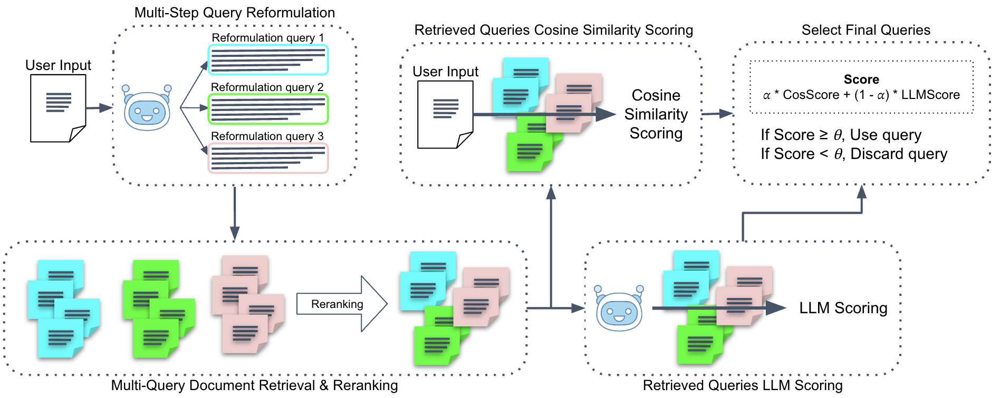
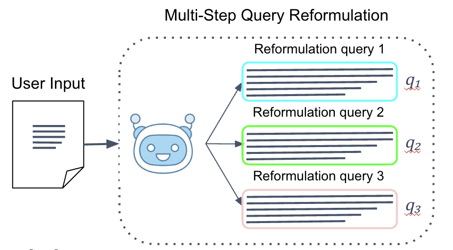
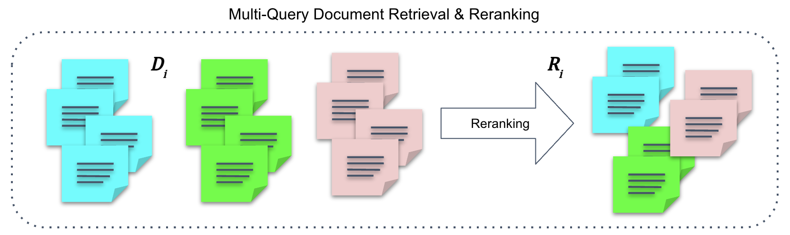
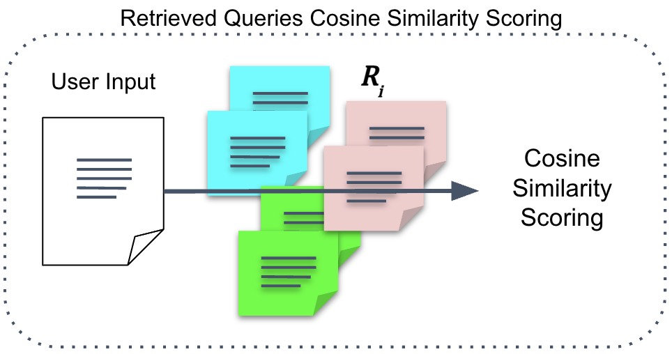
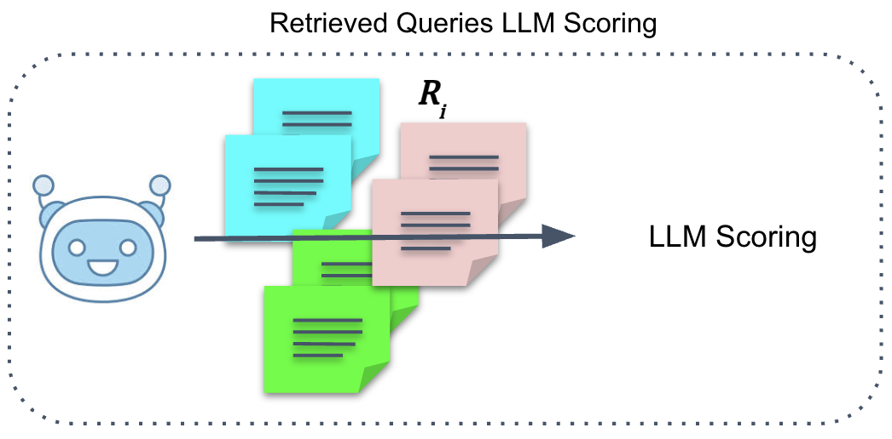
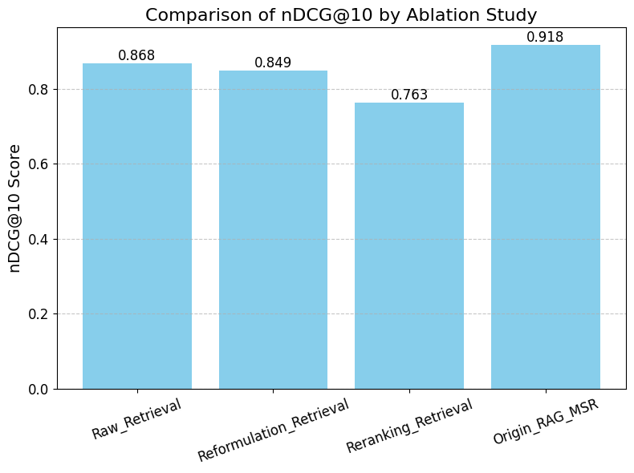

# RAG-MSR: Retrieval-Augmented Generation through Multi-Step Reformulation and Reranking

  

This repository contains the implementation of **R**etrieval-**A**ugmented **G**eneration through **M**ulti-**S**tep **R**eformulation and Reranking (RAG-MSR),  
a document retrieval framework that enhances retrieval robustness through the collaboration of multi-step query reformulation and document reranking.

This framework is designed to handle ambiguous or complex queries more effectively compared to vanilla RAG models.

RAG-MSR is designed to improve retrieval performance for ambiguous or complex queries by:

- Generating diverse reformulated queries from the original input query
- Performing document retrieval and intra-query reranking for each reformulated query
- Applying inter-query scoring and filtering to select the most relevant documents for generation

---

## Motivation

While Retrieval-Augmented Generation (RAG) has shown promising results in leveraging external knowledge for response generation,  
existing RAG frameworks still suffer from several critical limitations in real-world information-seeking tasks:

- Single-step retrieval often retrieves sub-optimal or incomplete documents, especially when the input query is ambiguous or underspecified.
- Limited diversity of reformulated queries restricts the search space, failing to capture various user intents and perspectives.
- Lack of robust filtering mechanisms leads to noisy or irrelevant documents being included in the final response, degrading generation quality.

These limitations become more severe in cases where:

- The input query is too short, keyword-based, or lacks sufficient context.
- The task requires reasoning over specific aspects, entities, or fine-grained details.
- The retrieved documents vary significantly in quality and relevance.

To overcome these challenges, we propose **RAG-MSR**, a novel multi-step retrieval framework that dynamically adapts to the query characteristics and  
enhances retrieval robustness through iterative query reformulation, fine-grained reranking, and adaptive document filtering.

---

## Methodology

### Step 1. Multi-Step Query Reformulation
Generate $3$ diverse reformulated queries from the user input query $q_{input}$ using LLM-based strategies.

  

We use **Llama-3.1-8B-Instruct** as the reformulation LLM in our framework,  
due to its strong instruction-following capability and cost-effective model size suitable for query rewriting tasks.

To enhance query diversity and intent disambiguation, we design multiple **reformulation prompts** such as:

- `Paraphrasing`: rewrites the original query using different expressions while preserving its meaning.
- `AspectSpecific`: reformulates the query by focusing on a specific aspect (e.g., cost, usability, performance).
- `EntityAware`: enhances the query by incorporating relevant entities to improve retrieval accuracy.

These reformulation prompts enable the LLM to generate diverse and aspect-rich queries, which are leveraged in the subsequent multi-step retrieval and reranking processes.

---

### Step 2. Multi-Query Document Retrieval & Initial Reranking

We retrieve $n$ documents independently for each reformulated query using a dense retrieval pipeline.

Each reformulated query is embedded using OpenAI's **text-embedding-3-small** model,  
and cosine similarity is computed with a pre-embedded document corpus(BEIR - nfcorpus) to identify relevant candidates.

The **top-5** documents with the highest similarity scores are selected as initial retrieval results for each query.  
This simple yet effective retrieval method enables flexibility in handling diverse reformulation types without requiring a dedicated retriever model.

To further improve the quality of the retrieved documents, we apply **intra-query reranking** within each document set.  
Each reformulated query is paired with its corresponding retrieved documents, and semantic relevance is reassessed using a cross-encoder.

We adopt **cross-encoder/ms-marco-MiniLM-L-6-v2**, a lightweight yet effective reranking model,  
which scores each (query, document) pair based on contextual alignment.

This reranking step enhances precision by prioritizing documents that are more semantically aligned with the user intent,  
ensuring that the final top-$m$ documents per query are of the highest quality.

  

---

### Step 3. Inter-Query Scoring & Filtering

We compute the final score $S_{final}$ between the input query and each retrieved document as a weighted sum of two scoring functions:

$$
S_{final} = \alpha \cdot S_{cos} + (1-\alpha) \cdot S_{LLM}
$$

Documents with $S_{final} \geq \theta$ are selected for the final response generation.

---

#### Cosine Scoring

We compute the cosine similarity $S_{cos}$ between the input query embedding $q_{input}$ and the document embedding $d$:

$$
S_{cos} = \frac{q_{input} \cdot d}{\|q_{input}\| \|d\|}
$$

This scoring encourages retrieving documents that are semantically similar to the input query based on vector space proximity.

  

---

#### LLM Scoring

We additionally compute **$S_{LLM}$** as the relevance score using **a scoring language model (LLM)**, which captures the **contextual alignment** between the input query and the retrieved document beyond shallow semantic similarity.

Specifically, we adopt **GPT-4o** as our scoring LLM, considering its strong ability in reasoning, content evaluation, and intent understanding.

Let $LLM(\cdot)$ denote the scoring model:

$$
S_{LLM} = LLM(q_{input}, d)
$$

This LLM-based score reflects deeper semantic understanding, evaluating:
- Relevance to the user’s intent
- Clarity and usefulness of the content
- Completeness and specificity of the answer
- Overall alignment with the original query

  

---

#### Final Filtering

The final filtering step selects documents that satisfy the score threshold condition:

$$
S_{final} \geq \theta
$$

Only the documents that exceed the threshold $\theta$ are considered sufficiently relevant and are retained as final retrieval candidates.
Documents with $S_{final}$ lower than the threshold are discarded from the final generation process,
ensuring that only high-confidence and contextually aligned knowledge is used in response generation.

---

## Experiment Results

We evaluate our RAG-MSR framework on the BEIR benchmark, specifically using the nfcorpus dataset.  
Retrieval performance is measured by nDCG@k (k=1,3,5,10).

  

| Method                    | nDCG@10 |
|---------------------------|---------|
| Raw Retrieval             | 0.868   |
| Reformulation Retrieval   | 0.849   |
| Reranking Retrieval       | 0.763   |
| Origin RAG-MSR            | 0.918   |

---

### Key Findings

- The combination of **Multi-Step Reformulation** and **Reranking** (Origin RAG-MSR) outperforms all other baselines in terms of overall nDCG@k performance.
- Reformulation-only and Reranking-only settings show limited performance improvement, highlighting the complementary effect of combining both modules.
- Our approach leverages the **LLM's ability to dynamically assess the input query type** (e.g., short keyword-style vs. full sentence) and apply the most suitable reformulation strategy accordingly.  
  This enables adaptive and context-aware rewriting, which is particularly effective in handling diverse and ambiguous real-world queries.
---

### Reformulation Error Analysis

We analyze the error rate of each reformulation type, defined as the proportion of irrelevant documents retrieved.

| Reformulation Type | Error Rate |
|-------------------|------------|
| Paraphrasing      | 0.20       |
| AspectSpecific    | 0.30       |
| EntityAware       | 0.50       |

> Reformulation failures frequently occur in short or keyword-only queries, especially for the EntityAware type.

---

### Reformulation Improvement

We designed new reformulation prompts — **Clarification**, **EntityExpansion**, and **RetrievalCondense** — to overcome the limitations of existing reformulation strategies.

| Reformulation Type | Error Rate |
|-------------------|------------|
| Clarification     | 0.0        |
| EntityExpansion   | 0.0        |
| RetrievalCondense | 0.0        |

These newly designed prompts significantly improved the robustness of reformulation and eliminated critical failures during the retrieval process.

---

In particular, we further introduced a dynamic query analysis prompt that allows the LLM to automatically determine the optimal reformulation strategy based on the characteristics of the input query.

Specifically, if the user input query is too short or keyword-based (e.g., entity name only, or a few words), the LLM expands it into a full natural language question with sufficient background context before applying the reformulation rule.  
If the query is already a full sentence, the LLM directly applies the original reformulation rule to refine the sentence.

This dynamic strategy enables RAG-MSR to handle diverse query types more effectively in real-world scenarios.

Example of the dynamic prompt for query analysis:

---

This comprehensive evaluation confirms that **RAG-MSR** effectively improves retrieval robustness and accuracy by **leveraging the complementary strengths of multi-step query reformulation and reranking**.  
Notably, the framework dynamically analyzes the input query type using LLMs to determine the most suitable reformulation strategy,  
enabling context-aware and adaptive query rewriting that significantly enhances overall retrieval performance.

## Repository Structure
